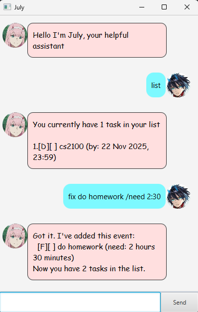

# July - Your Friendly Task Manager 🌟



***

July is a cute chatbot that helps you manage tasks through simple chat commands. No complicated menus - just chat with July like you would with a friend!

## Task Types 📝

- **[T]** Todo - Simple tasks
- **[D]** Deadline - Tasks with due dates
- **[E]** Event - Tasks with time slots
- **[F]** Fix - Tasks with time estimates

## Commands 💬

### Basic Tasks
```
todo read book                    → Simple task
deadline homework /by 5/7/2026  → Task with due date  
event meeting /from 14:00 /to 16:00 → Scheduled event
fix bug /need 2 hours             → Task needing time estimate
```

### Managing Tasks
```
list             → See all tasks
mark 2           → Mark task #2 as done
unmark 2         → Mark task #2 as not done
delete 3         → Remove task #3
find book        → Search tasks containing "book"
check 5/7/2026   → View task not done on 5th July 2026
bye              → Exit and save
```

## Time Formats 🕐

July understands various formats:
- **Dates**: `5/7/2026`, `2026-07-05`, `05-07-2026`
- **Times**: `14:30`, `9:00` 
- **Date & Time**: `5/7/2026 14:30`, `2026-07-05 09:00`


## Data Storage

July automatically saves your tasks to `data/savefile.txt`. Your tasks will persist between sessions, so you can close and reopen July without losing your data.

## Command Summary

| Command | Format                                        | Example                                                 |
|---------|-----------------------------------------------|---------------------------------------------------------|
| Add Todo | `todo <description>`                          | `todo read book`                                        |
| Add Deadline | `deadline <description> /by <date/time>`      | `deadline return book /by 5/7/2026 18:00`               |
| Add Event | `event <description> /from <start> /to <end>` | `event meeting /from 4/7/2026 23:59 /to 5/7/2026 23:59` |
| Add Fix | `fix <description> /need <timeonly>`          | `fix debug /need 2 hours and 30 minutes`                |
| List Tasks | `list`                                        | `list`                                                  |
| Mark Done | `mark <number>`                               | `mark 2`                                                |
| Unmark | `unmark <number>`                             | `unmark 2`                                              |
| Delete | `delete <number>`                             | `delete 3`                                              |
| Find | `find <keyword>`                              | `find book`                                             |
| Check | `check <date/datetime>`                       | `check 5/7/2026`                                        |
| Exit | `bye`                                         | `bye`                                                   |

---
*Chat now and get organized! 💙*
